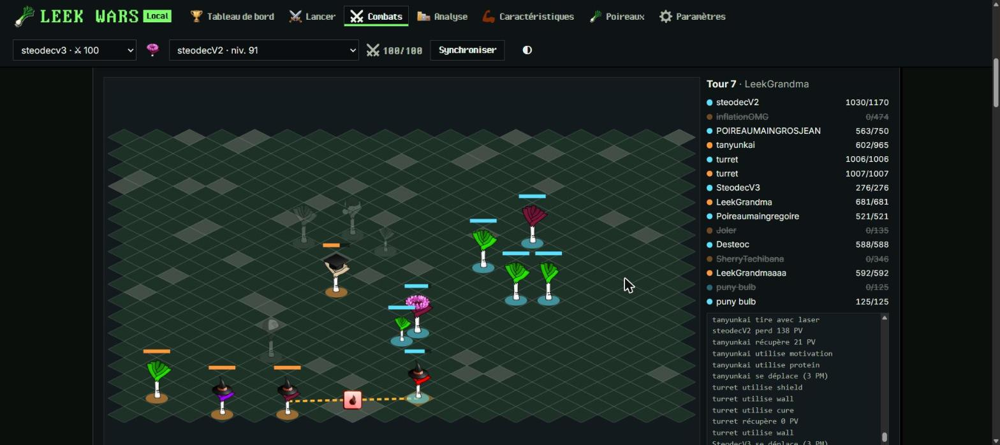
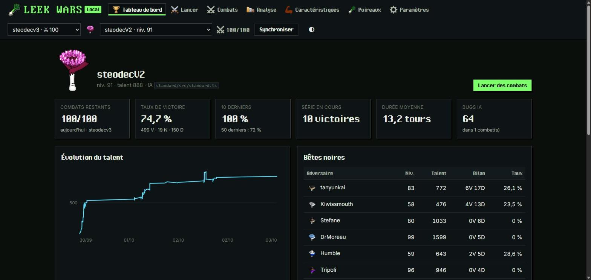
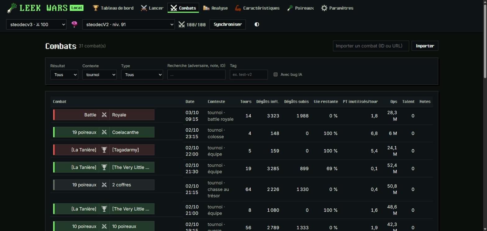
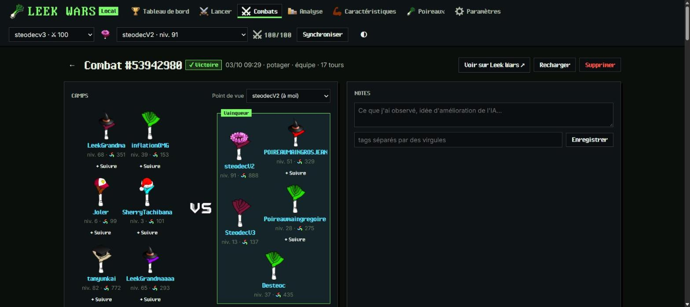
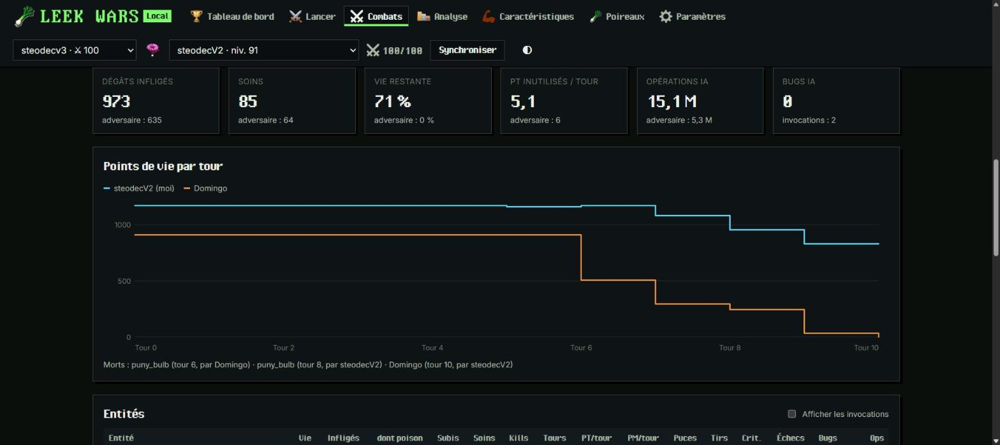
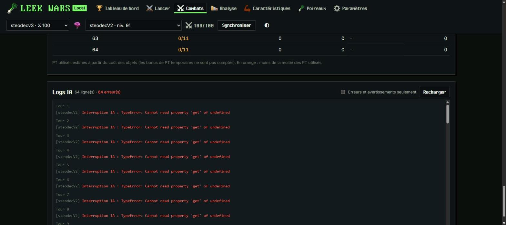
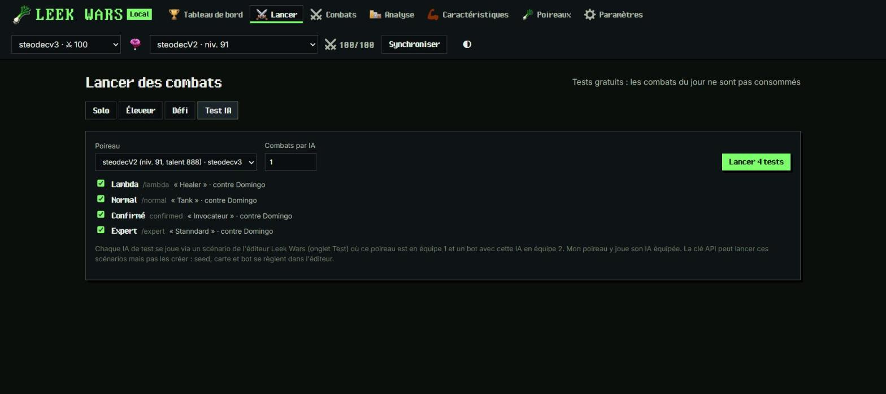
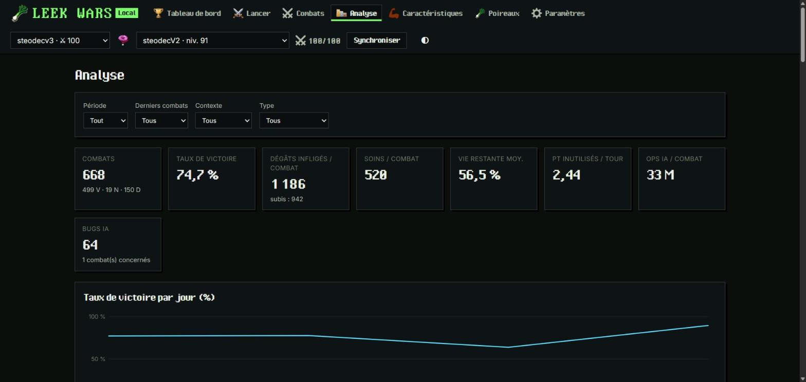
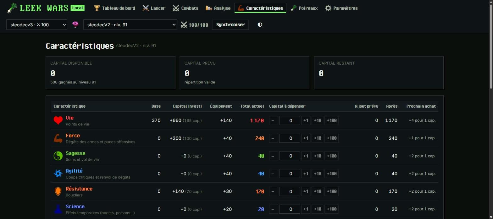
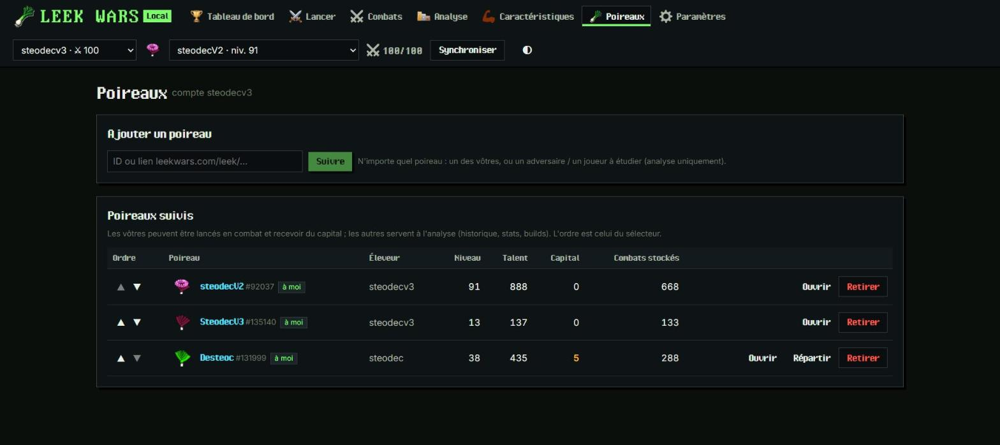

<div align="center">

# LeekWars Local

**Gérer, lancer, rejouer et analyser ses combats [Leek Wars](https://leekwars.com), en local.**

[**⬇ Télécharger pour Windows**](https://github.com/steodec/LeekWarsLocal/releases/latest/download/LeekWarsLocal-setup.exe)
· [toutes les versions](https://github.com/steodec/LeekWarsLocal/releases)
· [API locale](#api-locale)



</div>

LeekWars Local est une application de bureau (Windows) qui se branche sur votre compte Leek Wars avec une **clé API** :
elle importe l'historique de vos poireaux, lance des combats, les **rejoue**, et calcule ce que le site ne montre pas
(dégâts par puce, PT inutilisés, bêtes noires, taux de victoire par build…). Tout reste sur votre machine, dans une base
SQLite, et une **API REST locale** permet de piloter l'outil depuis un script ou un agent comme Claude.

## Fonctionnalités

### Tableau de bord

Combats restants, taux de victoire (global, 10 et 50 derniers), série en cours, évolution du talent, adversaires qui vous
battent le plus souvent et derniers combats. Plusieurs comptes Leek Wars peuvent être ajoutés ; un sélecteur dans l'en-tête
change le compte et le poireau affichés.



### Combats

Tout l'historique, filtrable par résultat, contexte, type, adversaire, tag ou bug IA. Chaque combat est résumé comme sur
Leek Wars : votre camp, l'icône du contexte (potager, défi, tournoi, arène) et le camp adverse, nommé selon le type de
combat (`[équipe]`, `(éleveur)`, Battle Royale, effectifs d'une guerre ou d'une chasse au trésor, colosse).



### Replay

Chaque combat se rejoue dans l'application : carte et obstacles, poireaux qui se déplacent, tirs et puces vers la case
visée (critiques et échecs distingués), dégâts, soins et poison, invocations, morts et messages. Lecture / pause, action
ou tour précédent / suivant, curseur et vitesse ; à côté, la vie de chaque entité et un journal des actions où s'insèrent
les logs de votre IA.

### Détail d'un combat

Camps et point de vue (n'importe quel participant), points de vie par tour, statistiques par entité (dégâts, soins,
PT / PM utilisés, critiques, échecs, bugs, opérations), objets utilisés, tour par tour, notes et tags, et « Rejouer en défi »
avec le même seed.

| | |
|---|---|
|  |  |

### Logs IA

Les `debug()` de votre IA et ses erreurs, groupés par tour : couleurs de `debugC`, avertissements, erreurs LeekScript
traduites, filtre « erreurs et avertissements seulement ».



### Analyse IA d'un combat

Avec une clé API **Claude** ou **ChatGPT** (Paramètres → Analyse IA des combats), la page d'un combat propose une analyse
par le modèle : **note de code** (robustesse, efficacité, logique de l'IA), **note de RPG** (build, équipement, tactique) et
**note globale** sur 100, puis l'analyse détaillée, les moments clés et des recommandations classées par priorité. Le modèle
reçoit le résumé du combat, le tour par tour, les logs et, pour vos poireaux, le code source de l'IA (lu via `ai/read`).
Le prompt par défaut est modifiable (dans Paramètres, ou ponctuellement depuis le combat) ; les analyses sont conservées.
Chaque analyse est facturée par le fournisseur sur votre clé.

### Lancer des combats et tester son IA

Combats solo ou éleveur (N combats, choix de l'adversaire : le plus faible, le plus proche en talent, le plus fort,
aléatoire, ou lot côté Leek Wars), défis à seed fixe pour rejouer exactement la même situation, et **tests d'IA** gratuits
contre les quatre IA de test de Leek Wars (lambda, normal, confirmé, expert), avec un bilan par IA.



> Les tests passent par les scénarios de l'onglet Test de l'éditeur Leek Wars : la clé API peut les lancer mais pas les
> créer. Préparez un scénario par IA (votre poireau en équipe 1, un bot avec cette IA en équipe 2).

### Analyse

Taux de victoire par jour, selon l'écart de niveau ou de talent, la durée, le contexte, le profil de l'adversaire et votre
build, utilisation et efficacité des puces et des armes, bilan par adversaire. Pour comparer deux périodes (avant / après
une modification d'IA), voir `/api/compare` dans l'[API locale](#api-locale).



### Caractéristiques et poireaux suivis

Planificateur de capital avec le coût réel par paliers (+1 / +10 / +100, simulation avant de dépenser) et historique des
builds avec leur taux de victoire. Suivez aussi n'importe quel autre poireau (ID ou lien) pour analyser ses combats.

| | |
|---|---|
|  |  |

## Installation

1. Téléchargez [`LeekWarsLocal-setup.exe`](https://github.com/steodec/LeekWarsLocal/releases/latest/download/LeekWarsLocal-setup.exe)
   et lancez-le. Il s'installe pour l'utilisateur courant, sans droits administrateur.
   Windows SmartScreen peut afficher « Windows a protégé votre ordinateur » : « Informations complémentaires » → « Exécuter quand même ».
2. Sur [leekwars.com](https://leekwars.com), **Paramètres → Clés API** : créez une clé avec le rôle **player**.
3. Dans l'application, **Paramètres** → ajoutez la clé (elle est vérifiée avant d'être enregistrée), puis **Synchroniser**
   pour importer l'historique de vos poireaux.

L'application se met à jour toute seule : elle vérifie les nouvelles versions au démarrage puis toutes les 6 h et propose
« Mettre à jour et redémarrer ». Les données sont dans `%APPDATA%\com.steodec.leekwarslocal\` (base `leekwars.db`) ; la clé
API ne quitte pas votre machine, sauf vers l'API Leek Wars.

## Développement

```bash
npm install
npm start                 # build de l'interface + serveur → http://127.0.0.1:3737
```

Rechargement à chaud : `npm run server` dans un terminal, `npm run dev` dans un autre → http://localhost:1420 (Vite redirige
`/api` vers le serveur). En application de bureau : `npm run server` puis `npm run tauri dev`.

- **Serveur** (`server/`) : Node sans dépendance. Il parle à l'API Leek Wars, stocke les combats dans une base **SQLite**
  (`node:sqlite`, Node ≥ 22.13) et les analyse. `LWL_DATA_DIR` change le dossier des données ; sans compte configuré, la
  variable `LEEKWARS_API_KEY` d'un fichier `.env` (voir `.env.example`) est importée comme premier compte.
- **Interface** (`src/`) : Vue 3, thème et images de Leek Wars (poireaux avec peau et chapeau, puces, armes, police pixel),
  thème clair / sombre / auto. Les images et polices sont dans `public/lw/` ; `npm run assets` les met à jour (clone léger
  de [leek-wars/leek-wars](https://github.com/leek-wars/leek-wars), licence GPL v3, et SVG des poireaux depuis leekwars.com).
- **Application de bureau** (`src-tauri/`) : `npm run tauri build` produit l'installeur
  `src-tauri/target/release/bundle/nsis/LeekWars Local_<version>_x64-setup.exe`. Le serveur y est embarqué en exécutable
  autonome (`npm run build:server` : esbuild + Node SEA) lancé comme *sidecar* : rien à installer, pas de Node. Une ancienne
  base `data/leekwars.db` du projet est fusionnée une fois au démarrage.
- **Copie de travail** : `npm run update` fait `git pull --ff-only`, `npm install` si les dépendances ont changé, puis
  reconstruit l'interface. Redémarrer ensuite le serveur.

### Publier une version

```bash
npm run release -- minor          # ou patch, major, 1.2.3
```

Incrémente la version partout, commit « Version X.Y.Z » et push. Sur une branche, la release part à la fusion dans `main` :
le workflow `.github/workflows/release.yml` construit l'installeur signé sur `windows-latest` et crée la release `vX.Y.Z`
(installeur, `.sig`, `latest.json` lu par l'updater, et `LeekWarsLocal-setup.exe` pour le lien de téléchargement stable).
Il ne publie que si la release de la version de `package.json` n'existe pas encore ; sur une pull request il se contente de
construire. Si un push sur `main` ne déclenche rien : `gh workflow run release.yml --ref main`.

**Clé de signature** : secret `TAURI_SIGNING_PRIVATE_KEY` du dépôt, copie locale `~/.tauri/leekwarslocal.key`. **À sauvegarder** :
sans elle, plus aucune mise à jour ne peut être publiée pour les applications déjà installées. Ne jamais la committer.

## API locale

Doc auto-générée : `GET http://127.0.0.1:3737/api`.

| Méthode | Route | Description |
|---|---|---|
| GET | `/api/status` | éleveur, poireaux, combats restants, tâches en cours |
| GET | `/api/leeks` | poireaux suivis (`owned` = à moi) + poireaux du compte non suivis |
| POST · PUT | `/api/leeks/tracked` | `{id}` suivre n'importe quel poireau (ID ou lien ; lance l'import de son historique) · `{ids:[…]}` réordonner |
| DELETE | `/api/leeks/tracked/:id` | ne plus suivre (`?purge=1` supprime aussi ses combats stockés) |
| GET | `/api/leeks/:id` | détail privé d'un poireau (équipement nommé) |
| GET | `/api/leeks/:id/characteristics` | caractéristiques détaillées + coût du prochain achat |
| POST | `/api/leeks/:id/characteristics/preview` | `{bonuses:{strength:10,…}}` simule sans dépenser |
| POST | `/api/leeks/:id/characteristics` | `{bonuses:{…}}` dépense le capital (vérifie paliers et capital avant d'appeler Leek Wars) |
| GET | `/api/capital-log` | dépenses de capital faites via l'outil |
| GET | `/api/opponents/:leekId` · `/api/opponents/farmer` | adversaires proposés (+ bilan local) |
| POST | `/api/fights/solo` | `{leekId, targetId?, strategy?, count?, batch?}` → tâche |
| POST | `/api/fights/farmer` | `{targetId?, strategy?, count?, batch?}` → tâche |
| POST | `/api/fights/challenge` | `{leekId, targetId, seed?, side?, count?}` → tâche |
| GET | `/api/fights/test` | IA de test (lambda, normal, confirmed, expert), bots et scénarios de l'éditeur ; `?leekId=` → scénario retenu par IA |
| POST | `/api/fights/test` | `{leekId, ais?, scenarioIds?, count?, aiPath?}` → tâche : combats de test gratuits contre les bots, via les scénarios de l'éditeur (la clé API ne peut pas les créer) |
| GET | `/api/jobs` · `/api/jobs/:id` | suivi des tâches (progression, combats, logs) |
| POST | `/api/sync` | `{leekIds?, limit?}` importe l'historique |
| POST | `/api/fights/import` | `{ids:[…], force?}` |
| GET | `/api/fights` | `leek` = point de vue (sans : mon éleveur) ; filtres : `leek, result, context, type, opponent, tag, source, bugs, since, until, q, last, limit, offset` |
| GET | `/api/fights/:id` | résumé + analyse complète, `?leek=` = point de vue (n'importe quel participant), `?refresh=1` re-télécharge |
| GET | `/api/fights/:id/raw` · `/api/fights/:id/logs` | données brutes / logs IA (`{éleveur: {action: [[entité, type, message, …]]}}`) |
| GET | `/api/fights/:id/replay` | carte, entités, actions et noms des puces / armes : de quoi rejouer le combat (lecteur de la page combat) |
| GET · POST | `/api/fights/:id/ai-analysis` | analyses IA conservées · lance une analyse Claude / ChatGPT `{leek?, provider?, model?, prompt?, includeCode?, dryRun?}` (`dryRun` : renvoie le message sans appeler le modèle) |
| DELETE | `/api/fights/:id/ai-analysis/:aid` | supprime une analyse IA |
| GET · PUT | `/api/ai/settings` | réglages de l'analyse IA (clés masquées, modèles, prompt) · `{provider?, anthropicKey?, openaiKey?, anthropicModel?, openaiModel?, prompt?, includeCode?}` |
| PATCH | `/api/fights/:id` | `{note?, tags?}` |
| DELETE | `/api/fights/:id` | retire du stockage local |
| GET | `/api/stats` | agrégats (mêmes filtres que `/api/fights`) |
| GET | `/api/compare?a=<query>&b=<query>` | compare deux jeux de filtres (ex. avant/après une modif d'IA) |
| GET · POST | `/api/accounts` | liste des comptes (clés masquées, combats restants) · `{apiKey, activate?}` ajoute un compte (suit ses poireaux, importe son historique) |
| PUT | `/api/accounts/active` · `/api/accounts/:id/key` · `/api/accounts/order` | `{id}` compte actif · `{apiKey}` nouvelle clé du même éleveur · `{ids}` ordre |
| DELETE | `/api/accounts/:id` | retire un compte (ses poireaux restent suivis en analyse, combats conservés) |
| GET | `/api/settings` | comptes, présence d'une clé .env, stockage |
| POST | `/api/backup` | copie de la base dans `backups/` (dossier des données) |
| * | `/api/lw/<module>/<fonction>` | proxy authentifié vers n'importe quelle route de l'API Leek Wars |

Exemples :

```bash
curl -s localhost:3737/api/status
curl -s -X POST localhost:3737/api/fights/solo -H 'Content-Type: application/json' -d '{"leekId":92037,"count":5,"strategy":"closest"}'
curl -s "localhost:3737/api/stats?leek=92037&last=50"
curl -s "localhost:3737/api/compare?a=since%3D1790700000%26until%3D1790800000&b=since%3D1790800000"
```

## Notes

- L'ancien stockage local du projet (`data/` : `leekwars.db`, sauvegardes, ancien stockage JSON dans `data/legacy-json/`) et `.env` sont ignorés par git.
- Chaque combat est stocké une fois (données brutes compressées) ; un résumé d'analyse est calculé par point de vue : mon éleveur et chaque poireau suivi qui y participe.
- Les poireaux qui ne sont pas à moi sont en lecture seule : pas de lancement de combat ni de capital.
- Les PT « inutilisés » sont estimés à partir du coût des objets ; les bonus de PT temporaires ne sont pas comptés.
- Certains combats sont refusés par Leek Wars (`fight_with_secret_trophy`) et ne peuvent pas être importés.

## Crédits

Images, polices et textes du jeu : client [Leek Wars](https://github.com/leek-wars/leek-wars) (licence GPL v3, voir
`public/lw/LICENSE` et `public/lw/NOTICE.md`) et [leekwars.com](https://leekwars.com). Projet non officiel, sans lien
avec l'équipe de Leek Wars.
